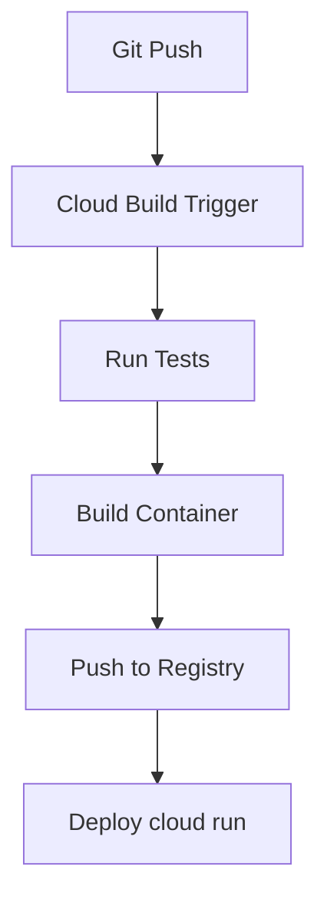

# CSV Metrics Reporter

A lightweight, event-driven Python service built on **Google Cloud Run**. It listens for new CSV uploads to a Cloud Storage bucket, computes column-wise and row-wise statistics, and stores the results as JSON reports. Duplicate processing is avoided using **Firestore** as a tracking layer.

---

## Features

* Triggered via **Pub/Sub** when CSV files land in a `raw-data/` folder
* Computes metrics: **row/column count**, **null values**, **data types**
* Outputs saved as **JSON** in the `reports/` folder
* Enforces **idempotent processing** via Firestore and GCS existence checks
* **CI/CD ready** with Docker and Cloud Build

---

## Project Structure

```bash
csv-metrics-reporter/
├── main.py             # Flask app with CSV processing logic
├── test_main.py        # Unit tests
├── Dockerfile
├── .dockerignore
├── requirements.txt
├── cloudbuild.yaml     # CI/CD pipeline
└── README.md
```

---

## System Workflow


1. A CSV file is uploaded to `gs://gcs-csv-reporter/raw-data/*.csv`
2. GCS emits a notification to a Pub/Sub topic
3. Cloud Run is triggered with file metadata
4. If already processed, the request is skipped
5. The service:

   * Validates the source
   * Reads the CSV from GCS
   * Computes row/column counts, nulls, and data types
   * Writes output to `reports/<filename>_metrics.json`
   * Logs metadata in Firestore

---

## Example Output

```json
{
  "row_count": 3500,
  "column_count": 7,
  "columns": ["id", "sales", "region", "date", "customer", "product", "quantity"],
  "null_counts": {
    "id": 0,
    "sales": 5,
    "region": 0,
    "date": 1,
    "customer": 0,
    "product": 0,
    "quantity": 0
  },
  "datatype_summary": {
    "id": "int64",
    "sales": "float64",
    "region": "object",
    "date": "object",
    "customer": "object",
    "product": "object",
    "quantity": "int64"
  }
}
```
---

## CI/CD Pipeline

The CI/CD pipeline automatically handles the entire development lifecycle:

1. Runs unit tests
2. Builds the Docker container
3. Pushes the container to Google Artifact Registry
4. Deploys to cloud run service



### Error Handling

The API returns appropriate HTTP status codes with descriptive error messages:

- `400 Bad Request` - Invalid filetype or invalid bucket
- `401 Unauthorized` - Missing or invalid authentication
- `500 Internal Server Error` - Processing or database errors

---

## Local Development

### Prerequisites

- Python 3.9 or higher
- Google Cloud SDK installed and configured
- Docker (for container development)
- google cloud storage, firestore API enabled
- google cloud storage bucket, with raw-data/ and reports/ folders
- firestore default database
- GCP service account with GCS and Firestore access

### Setup Steps

1. Clone the repository
   ```bash
   git clone https://github.com/royal-dsouza/csv-metrics-reporter
   cd csv-metrics-reporter
   ```

2. Set up a virtual environment
   ```bash
   python -m venv venv
   source venv/bin/activate  # On Windows: venv\Scripts\activate
   ```

3. Install dependencies
   ```bash
   pip install -r requirements.txt
   ```

4. Configure environment variables
   ```bash
   export BUCKET_NAME="gcs-csv-reporter"
   export RAW_DATA_FOLDER="raw-data"
   export REPORTS_FOLDER="reports"
   export PROCESSED_COLLECTION="processed_files"
   export GOOGLE_APPLICATION_CREDENTIALS="path/to/service-account-key.json"
   ```

5. Run tests
   ```bash
   python -m pytest tests/ -v
   ```

6. Start local development server
   ```bash
   python main.py
   ```

7. Build and test locally with Docker
   ```bash
   docker build -t csv-metrics-reporter .
   docker run -p 8080:8080 \
     -e BUCKET_NAME="gcs-csv-reporter" \
     -e RAW_DATA_FOLDER="raw-data" \
     -e REPORTS_FOLDER="reports" \
     -e PROCESSED_COLLECTION="processed_files" \
     -e GOOGLE_APPLICATION_CREDENTIALS="path/to/service-account-key.json" 
     csv-metrics-reporter
   ```

## API Usage for local development

Send HTTP POST requests to the localhost endpoint with JSON payloads representing encoded pubsub message:
 
```bash
curl -X POST http://localhost:8080 \
    -H "Content-Type: application/json" \
    -d '{
          "message": {
            "data": "eyJidWNrZXQiOiAiZ2NzLWNzdi1yZXBvcnRlciIsICJuYW1lIjogInJhdy1kYXRhL3NhbXBsZS5jc3YifQ=="
           }
        }'
```

### Example Response

```json
{
    "input_file": "raw-data/sample.csv",
    "metrics_summary": {
        "column_count": 7,
        "row_count": 10
    },
    "output_file": "reports/sample_metrics.json",
    "status": "success"
}
```

---

## Cloud Deployment

### GCP Project Setup

1. Enable required APIs
   ```bash
   gcloud services enable run.googleapis.com \
     cloudbuild.googleapis.com \
     storage.googleapis.com \
     pubsub.googleapis.com \
     firestore.googleapis.com \
     logging.googleapis.com \
     iam.googleapis.com
   ```

2. Configure service accounts and IAM roles
   ```bash
   # Create service account for the application
   gcloud iam service-accounts <service-account-name> \
    --display-name="<service-account-name>"
   
   gcloud projects add-iam-policy-binding ${PROJECT_ID} \
    --member="serviceAccount:${SERVICE_ACCOUNT}" \
    --role="roles/storage.objectAdmin" \
    --role="roles/cloudbuild.logsWriter" \
    --role="roles/cloudbuild.serviceAgent" \
    --role="roles/datastore.user" \
    --role="roles/run.admin" \
    --role="roles/logging.logWriter" \
    --role="roles/secretmanager.secretAccessor" \
    --role="roles/iam.serviceAccountUser"
   ```

### Update substitutions in cloudbuild.yaml

```yaml
substitutions:
  _BUCKET_NAME: gcs-csv-reporter
  _RAW_DATA_FOLDER: raw-data
  _REPORTS_FOLDER: reports
  _PROCESSED_COLLECTION: processed_files
```

### Create Cloud Build trigger
- Navigate to Cloud Build > Triggers
- Click "Create Trigger"
- Connect to GitHub repository
- Configure trigger settings:
   - Name: `CSV-metrcs-reporter`
   - Event: `Push to branch`
   - Repository: `your_repository`
   - Branch: `^main$`
   - Configuration: `Cloud Build configuration file (YAML)`
   - Location: `Repository`
   - File: `cloudbuild.yaml`

